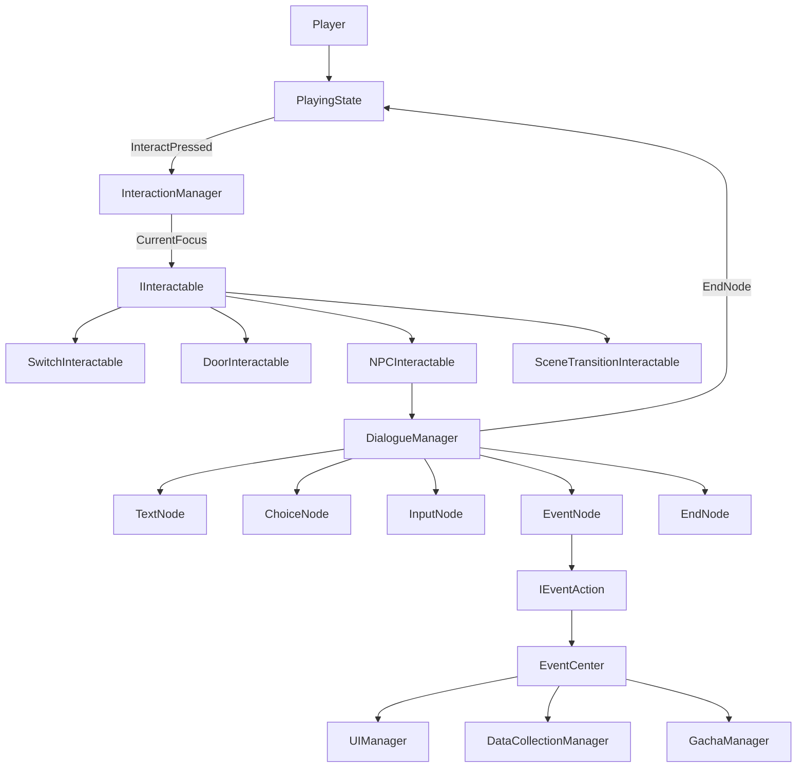

# 交互框架方案

## 一、文档定位与适用范围

本文档是 **平台跳跃 + 类银河恶魔城 + 玩家行为数据采集** 项目的专属交互框架设计说明。

适用范围：

* **场景物体主动交互**（开关、门、NPC、场景切换点）
* **剧情对话**（文本、选项分支、密码/问答输入）
* **剧情事件**（开门、给道具、完成任务、抽卡等副作用）
* **远期扩展**（任务、背包、商店、存档）

不适用（已有独立实现，不走本框架）：

* **被动碰撞触发**（金币自动拾取、尖刺伤害、敌人接触击杀、目标点通关）
* **主菜单 / 暂停 / 死亡 / 复活** 等游戏流程状态（见 `基础主循环.md`）

运行容器为 `Assets/Game/Scenes/Gameplay.unity`，关卡内容由 `Assets/Game/Configs/Scenes/*.json`（SceneConfig）描述并在运行时生成。交互物生成后挂载于 `SceneRoot/GameplayLayer/Runtime_Interactables`。

---

## 二、设计原则

### 2.1 事件驱动 + 数据驱动

不要把 NPC、门、开关、抽卡机各自做成独立系统。统一为：

```text
玩家输入
    ↓
InteractionManager（统一入口）
    ↓
IInteractable（行为分发）
    ↓
DialogueManager / 直接效果
    ↓
EventCenter（副作用广播）
    ↓
UI / 背包 / 任务 / 存档 / 数据采集
```

### 2.2 核心约束

| 原则 | 说明 |
|------|------|
| 单一入口 | 所有 `triggerType: "interact"` 的对象经 `InteractionManager` 触发 |
| 数据驱动 | 场景布局用 SceneConfig JSON；剧情/抽卡池用 ScriptableObject |
| 低耦合 | 模块间通过 `EventCenter` 通信，不互相直接引用 |
| 可扩展 | 新增节点类型或事件动作只加类，不改 Manager 核心逻辑 |
| 可采集 | 交互与对话路径写入 `DataCollectionManager` |

ScriptableObject 适合存放不会频繁变化的配置数据（对话、抽卡池、NPC 数据等）。([Unity Docs][1])

---

## 三、本项目现状

### 3.1 已实现

| 模块 | 文件 / 节点 | 状态 |
|------|-------------|------|
| 游戏主循环 | `Assets/Game/Scripts/Core/GameLoop.cs` | 已实现 |
| 游戏状态机 | `GameStateMachine` + `IGameState` | 已实现（MainMenu → Playing → Paused / Death / Clear 等） |
| 玩家移动 | `Assets/Game/Scripts/Player/PlayerController.cs` | 已实现 |
| 输入系统 | `Assets/Game/Scripts/Managers/InputManager.cs` | 已实现（Move / Jump / Pause），**无 Interact** |
| 被动拾取 | `Assets/Game/Scripts/Collectible/CollectibleItem.cs` | 已实现（`OnTriggerEnter2D` 自动拾取） |
| 被动伤害 | `SpikeTrap` / `PatrolEnemy` | 已实现（碰撞触发） |
| 场景节点 | `Runtime_Interactables` | 已创建（`Gameplay.unity`），**无子对象逻辑** |
| 提示 UI 壳 | `Canvas_Prompt/InteractionPrompt` | 已创建（`PersistentRoot.prefab`），**无脚本** |
| 物理/排序层 | `Assets/Game/Scripts/Core/GameLayers.cs` | 已定义 Trigger / Mechanism / InteractiveUp 等 |
| SceneConfig 规范 | `Assets/docs/最终场景配置方案.md` | 已定义 `triggerType: "interact"` 字段 |

### 3.2 待建

| 模块 | 计划路径 | 优先级 |
|------|----------|--------|
| `IInteractable` 接口 | `Assets/Game/Scripts/Interaction/` | Phase 1 |
| `InteractionManager` | 同上 | Phase 1 |
| `SwitchInteractable` / `DoorInteractable` | 同上 | Phase 1 |
| `Interact` 输入动作 | `GameInputActions.inputactions` | Phase 1 |
| `InteractionPromptController` | `Assets/Game/Scripts/UI/` | Phase 1 |
| `EventCenter` | `Assets/Game/Scripts/Core/EventCenter.cs` | Phase 1 |
| `DialogueManager` + 节点体系 | `Assets/Game/Scripts/Dialogue/` | Phase 2 |
| `DialogueState` | `Assets/Game/Scripts/States/DialogueState.cs` | Phase 2 |
| `NPCInteractable` | `Assets/Game/Scripts/Interaction/` | Phase 2 |
| `SceneTransitionInteractable` | 同上 | Phase 3 |
| `InteractableSpawner` | `Assets/Game/Scripts/SceneSystem/` | Phase 3 |
| `GachaManager` / `InventoryManager` | 远期 | Phase 4 |

### 3.3 与被动触发的边界

SceneConfig 中 `triggerType` 决定触发方式，**不可混用**：

| triggerType | 行为 | 负责模块 | 现有参考 |
|-------------|------|----------|----------|
| `touch` | 玩家碰撞即触发 | 各 MonoBehaviour 的 `OnTriggerEnter2D` | `CollectibleItem`、`SpikeTrap` |
| `interact` | 进入范围 → 显示提示 → 按交互键执行 | `InteractionManager` + `IInteractable` | **待建** |
| `enter_area` | 进入区域自动触发（如掉落切关） | `SceneTransitionManager` | **待建** |

---

## 四、整体架构与数据流

### 4.1 架构总览



### 4.2 完整数据流（一次 NPC 对话）

```text
玩家走近 NPC
    ↓
InteractableBase.OnTriggerEnter2D → InteractionManager 注册
    ↓
InteractionManager 设 CurrentFocus → EventCenter 广播焦点变化
    ↓
InteractionPromptController 显示 "[E] 交谈"
    ↓
玩家按 Interact（PlayingState 轮询）
    ↓
NPCInteractable.Interact(context)
    ↓
DialogueManager.Start(dialogueSO) → GameStateMachine 切到 Dialogue
    ↓
TextNode → ChoiceNode → InputNode → EventNode → EndNode
    ↓
GameStateMachine 回到 Playing
    ↓
DataCollectionManager 记录交互与对话路径
```

### 4.3 与游戏主状态机的关系

本项目已有两层状态机，职责分离：

| 状态机 | 职责 | 文件 |
|--------|------|------|
| 游戏级 FSM | 菜单、游玩、暂停、死亡、对话、通关 | `GameStateMachine` + `GameStateType` |
| 对话节点 FSM | 文本、选项、输入、事件、结束 | `DialogueManager` + `DialogueNode` |
| 玩家动画 FSM | Idle / Run / Jump / Landing | `PlayerAnimationStateController` |

对话进行中由 `DialogueState` 接管输入（UI 模式），并锁定玩家移动；对话结束后回到 `PlayingState`。

---

## 五、目录与文件规划

```text
Assets/Game/Scripts/
├── Core/
│   ├── GameLoop.cs              # 已有：注册 DialogueState、挂载 Manager
│   ├── GameContext.cs           # 扩展：InteractionManager、DialogueManager
│   ├── GameStateType.cs         # 扩展：Dialogue
│   ├── EventCenter.cs           # 新建：强类型事件总线
│   └── GameEvents.cs            # 新建：事件常量
│
├── Interaction/                 # 新建
│   ├── IInteractable.cs
│   ├── InteractableBase.cs
│   ├── InteractionManager.cs
│   ├── SwitchInteractable.cs
│   ├── DoorInteractable.cs
│   ├── NPCInteractable.cs
│   └── SceneTransitionInteractable.cs
│
├── Dialogue/                    # 新建
│   ├── DialogueManager.cs
│   ├── DialogueSO.cs
│   ├── DialogueContext.cs
│   ├── Nodes/
│   │   ├── DialogueNode.cs
│   │   ├── TextNode.cs
│   │   ├── ChoiceNode.cs
│   │   ├── InputNode.cs
│   │   ├── EventNode.cs
│   │   └── EndNode.cs
│   └── Actions/
│       ├── IEventAction.cs
│       ├── OpenDoorAction.cs
│       ├── GiveItemAction.cs
│       ├── PlayAnimationAction.cs
│       └── StartGachaAction.cs
│
├── States/
│   └── DialogueState.cs         # 新建
│
├── UI/
│   ├── InteractionPromptController.cs   # 新建
│   ├── DialogueUIController.cs        # 新建
│   ├── ChoiceUIController.cs          # 新建
│   └── InputUIController.cs             # 新建
│
├── SceneSystem/                 # 远期
│   └── InteractableSpawner.cs
│
└── Managers/
    ├── InputManager.cs          # 扩展：InteractPressed
    └── UIManager.cs             # 可选：封装 Prompt 显示

Assets/Game/Configs/
├── GameInputActions.inputactions  # 扩展：Interact 动作
├── Dialogue/                      # DialogueSO 资产
│   └── dlg_tutorial_001.asset
├── Gacha/                         # 远期：GachaPoolSO
└── Scenes/                        # SceneConfig JSON
    └── Scene_001_RuinsEntrance.json
```

---

## 六、第一层：Interaction 系统

### 6.1 设计目标

所有 `triggerType: "interact"` 的场景对象统一经 `InteractionManager` 触发，`InteractionManager` 本身不因新增交互类型而修改。

### 6.1 检测策略：Trigger 注册制

**不推荐**每帧 `Physics2D.OverlapCircle` 扫描。

**推荐**：每个 `InteractableBase` 挂载 `CircleCollider2D(isTrigger)`，玩家进入/离开范围时向 `InteractionManager` 注册/注销。Manager 维护「当前范围内列表」，选取距离玩家最近且 `CanInteract == true` 的目标作为 `CurrentFocus`。

### 6.2 核心接口

```csharp
public interface IInteractable
{
    string InteractPrompt { get; }       // 例："与向导交谈" / "拉动开关"
    bool CanInteract { get; }             // 门已开、一次性已触发等返回 false
    void Interact(GameContext context);
}
```

### 6.3 InteractableBase（公共基类）

```csharp
public abstract class InteractableBase : MonoBehaviour, IInteractable
{
    [SerializeField] private string interactPrompt;
    [SerializeField] private float interactRadius = 1.5f;

    public virtual string InteractPrompt => interactPrompt;
    public virtual bool CanInteract => true;

    public abstract void Interact(GameContext context);

    private void OnTriggerEnter2D(Collider2D other)
    {
        if (other.GetComponentInParent<PlayerController>() == null) return;
        InteractionManager.Instance.Register(this);
    }

    private void OnTriggerExit2D(Collider2D other)
    {
        if (other.GetComponentInParent<PlayerController>() == null) return;
        InteractionManager.Instance.Unregister(this);
    }
}
```

### 6.4 InteractionManager

职责：

1. 维护范围内 `IInteractable` 列表
2. 每帧更新 `CurrentFocus`（最近可交互目标）
3. 焦点变化时 `EventCenter.Publish(GameEvents.InteractionFocusChanged, focus)`
4. 响应 `InteractPressed`：对 `CurrentFocus` 调用 `Interact(context)`

```csharp
public class InteractionManager : MonoBehaviour
{
    public static InteractionManager Instance { get; private set; }

    private readonly List<IInteractable> inRange = new();
    public IInteractable CurrentFocus { get; private set; }

    public void Register(IInteractable interactable) { /* 加入列表，刷新焦点 */ }
    public void Unregister(IInteractable interactable) { /* 移出列表，刷新焦点 */ }

    public bool TryInteract(GameContext context)
    {
        if (CurrentFocus == null || !CurrentFocus.CanInteract) return false;
        if (!context.InputManager.InteractPressed) return false;

        CurrentFocus.Interact(context);
        return true;
    }

    public void Tick(GameContext context, Transform playerTransform)
    {
        RefreshFocus(playerTransform.position);
    }
}
```

### 6.5 具体实现类

| 类 | SceneConfig 来源 | Interact() 行为 |
|----|------------------|-----------------|
| `SwitchInteractable` | `mechanisms[type=switch, triggerType=interact]` | 切换开关状态 → 通过 `EventCenter` 通知 `targetIds` 关联的门/平台 |
| `DoorInteractable` | `mechanisms[type=door]` | 播放开门动画；也可被 Switch 远程触发（订阅 `OpenDoor` 事件） |
| `NPCInteractable` | `objects[type=npc]` | `context.DialogueManager.Start(dialogueSO)` |
| `SceneTransitionInteractable` | `transitions[triggerType=interact]` | `SceneTransitionManager.TransitionTo(targetScene, targetSpawnId)` |

#### SwitchInteractable 示例

```csharp
public class SwitchInteractable : InteractableBase
{
    [SerializeField] private string[] targetIds;
    [SerializeField] private bool once;
    private bool activated;

    public override bool CanInteract => !once || !activated;

    public override void Interact(GameContext context)
    {
        activated = true;
        foreach (var id in targetIds)
            EventCenter.Publish(GameEvents.MechanismActivated, id);
    }
}
```

#### NPCInteractable 示例

```csharp
public class NPCInteractable : InteractableBase
{
    [SerializeField] private DialogueSO dialogue;

    public override void Interact(GameContext context)
    {
        context.DialogueManager.Start(dialogue, context);
    }
}
```

### 6.6 反模式（禁止）

```text
❌ NPC.cs / Door.cs / Switch.cs 各自监听输入、各自显示 UI
❌ 在 PlayingState 里写 if (nearNPC) / if (nearDoor)
❌ InteractionManager 里 switch(objectType) 分支处理具体逻辑
```

---

## 七、第二层：Dialogue 节点状态机

### 7.1 设计目标

剧情不写 `if (id == 1)` / `if (id == 2)`，全部由 `DialogueSO` 节点链驱动。`DialogueManager` 只负责「当前节点 → Execute → 等待输入 → Next」。

### 7.2 数据结构

```csharp
[CreateAssetMenu(fileName = "Dialogue", menuName = "Game/Dialogue")]
public class DialogueSO : ScriptableObject
{
    public string dialogueId;
    [SerializeReference] public DialogueNode startNode;
}
```

```csharp
[Serializable]
public abstract class DialogueNode
{
    public string nodeId;
    public abstract DialogueNodeStep Enter(DialogueContext ctx);
    public abstract void Tick(DialogueContext ctx);
}

public enum DialogueNodeStep
{
    Waiting,    // 等待玩家输入（文本确认、选项、密码）
    AutoAdvance // 立即进入下一节点（EventNode）
}
```

### 7.3 节点类型

| 节点 | 序列化字段 | 行为 |
|------|-----------|------|
| `TextNode` | `speaker`, `text`, `nextNode` | 显示对话 UI → 等待 Confirm → 进入 nextNode |
| `ChoiceNode` | `ChoiceOption[]`（text + nextNode） | 动态生成选项按钮 → 玩家选择 → 进入对应 nextNode |
| `InputNode` | `question`, `expectedAnswer`, `successNode`, `failNode` | 隐藏对话 UI → 显示 InputUI → 验证答案 |
| `EventNode` | `IEventAction[] actions`, `nextNode` | 依次执行动作 → 自动进入 nextNode |
| `EndNode` | — | 关闭 UI → 通知 DialogueManager 结束 → 回到 Playing |

### 7.4 DialogueManager 状态

```text
Idle
    ↓ Start(DialogueSO, GameContext)
Running
    ↓ CurrentNode.Enter()
    ├── TextNode     → Waiting（等 Confirm）
    ├── ChoiceNode   → Waiting（等选项）
    ├── InputNode    → Waiting（等输入提交）
    ├── EventNode    → AutoAdvance
    └── EndNode      → Idle
```

```csharp
public class DialogueManager : MonoBehaviour
{
    private DialogueSO currentDialogue;
    private DialogueNode currentNode;
    private DialogueContext context;
    private bool isRunning;

    public void Start(DialogueSO dialogue, GameContext gameContext)
    {
        currentDialogue = dialogue;
        context = new DialogueContext(gameContext, this);
        currentNode = dialogue.startNode;
        isRunning = true;
        AdvanceTo(currentNode);
    }

    public void Tick()
    {
        if (!isRunning || currentNode == null) return;
        currentNode.Tick(context);
    }

    public void AdvanceTo(DialogueNode node) { /* 切换节点，发布采集事件 */ }
    public void End() { /* isRunning = false，触发状态机回 Playing */ }
}
```

社区普遍按 **节点(Node) + Manager** 组织对话，而非把剧情写进代码。([Unity Discussions][2])

---

## 八、第三层：InputNode 与 ChoiceNode

### 8.1 InputNode（密码 / 问答）

流程：

```text
DialogueManager 进入 InputNode
    ↓
DialogueUI 隐藏
    ↓
InputUI 显示（问题文案 + 输入框 + 确认按钮）
    ↓
玩家提交
    ↓
验证 expectedAnswer
    ├── 正确 → successNode
    └── 错误 → failNode
```

InputNode 只保存数据，不含验证逻辑以外的代码：

```csharp
[Serializable]
public class InputNode : DialogueNode
{
    public string question;
    public string expectedAnswer;
    [SerializeReference] public DialogueNode successNode;
    [SerializeReference] public DialogueNode failNode;
}
```

采集：`EventCenter.Publish(GameEvents.DialogueInputResult, new DialogueInputResult(nodeId, success))`

### 8.2 ChoiceNode（剧情分支）

```csharp
[Serializable]
public class ChoiceOption
{
    public string text;
    [SerializeReference] public DialogueNode nextNode;
}

[Serializable]
public class ChoiceNode : DialogueNode
{
    public ChoiceOption[] options;
}
```

UI 职责（`ChoiceUIController`）：

```text
foreach (option in options)
    生成 Button(option.text)
        ↓ 点击
    DialogueManager.AdvanceTo(option.nextNode)
```

采集：`EventCenter.Publish(GameEvents.DialogueChoice, new DialogueChoiceResult(nodeId, choiceIndex))`

---

## 九、第四层：EventNode + IEventAction

### 9.1 设计目标

剧情副作用（开门、给道具、完成任务、抽卡、播动画）不写在 `DialogueManager` 里，通过可序列化的 `IEventAction` 列表扩展。

### 9.2 接口

```csharp
public interface IEventAction
{
    void Execute(EventContext ctx);
}

public class EventContext
{
    public GameContext Game;
    public DialogueContext Dialogue;
    public string SourceNodeId;
}
```

### 9.3 首批实现

| 动作类 | 字段 | 行为 |
|--------|------|------|
| `OpenDoorAction` | `doorId` | `EventCenter.Publish(GameEvents.OpenDoor, doorId)` |
| `GiveItemAction` | `itemId`, `count` | `EventCenter.Publish(GameEvents.AddItem, ...)` |
| `CompleteQuestAction` | `questId` | `EventCenter.Publish(GameEvents.QuestComplete, questId)` |
| `PlayAnimationAction` | `targetId`, `animName` | 查找场景对象播放 Animator 状态 |
| `StartGachaAction` | `poolId` | `GachaManager.Draw(poolId)` |
| `TransitionSceneAction` | `sceneId`, `spawnId` | `SceneTransitionManager.TransitionTo(...)` |

### 9.4 EventNode

```csharp
[Serializable]
public class EventNode : DialogueNode
{
    [SerializeReference] public List<IEventAction> actions = new();
    [SerializeReference] public DialogueNode nextNode;

    public override DialogueNodeStep Enter(DialogueContext ctx)
    {
        var eventCtx = new EventContext { Game = ctx.Game, Dialogue = ctx, SourceNodeId = nodeId };
        foreach (var action in actions)
            action.Execute(eventCtx);
        ctx.Manager.AdvanceTo(nextNode);
        return DialogueNodeStep.AutoAdvance;
    }
}
```

### 9.5 扩展方式

后续新增动作（播放 CG、Timeline、开始 Boss 战）只需：

1. 新建类实现 `IEventAction`
2. 在 Inspector 的 EventNode 中添加该动作

**不需要修改 `DialogueManager`。**

---

## 十、第五层：EventCenter 事件总线

### 10.1 设计目标

Interaction、Dialogue、Gacha、Inventory、UI、DataCollection 互不直接引用，通过强类型事件通信。

### 10.2 实现约定

```csharp
public static class EventCenter
{
    private static readonly Dictionary<object, List<Delegate>> handlers = new();

    public static void Subscribe<T>(GameEvent<T> e, Action<T> handler) { /* ... */ }
    public static void Unsubscribe<T>(GameEvent<T> e, Action<T> handler) { /* ... */ }
    public static void Publish<T>(GameEvent<T> e, T data) { /* 遍历调用 */ }
}

public readonly struct GameEvent<T>
{
    public GameEvent(string name) => Name = name;
    public string Name { get; }
}
```

### 10.3 事件清单（GameEvents）

```csharp
public static class GameEvents
{
    // Interaction
    public static readonly GameEvent<IInteractable> InteractionFocusChanged = new("InteractionFocusChanged");
    public static readonly GameEvent<InteractRecord> InteractStarted = new("InteractStarted");

    // Dialogue
    public static readonly GameEvent<DialogueSO> DialogueStarted = new("DialogueStarted");
    public static readonly GameEvent<string> DialogueNodeEntered = new("DialogueNodeEntered");
    public static readonly GameEvent<DialogueChoiceResult> DialogueChoice = new("DialogueChoice");
    public static readonly GameEvent<DialogueInputResult> DialogueInputResult = new("DialogueInputResult");
    public static readonly GameEvent<DialogueSO> DialogueEnded = new("DialogueEnded");

    // Gameplay side effects
    public static readonly GameEvent<string> OpenDoor = new("OpenDoor");
    public static readonly GameEvent<string> MechanismActivated = new("MechanismActivated");
    public static readonly GameEvent<ItemStack> AddItem = new("AddItem");
    public static readonly GameEvent<string> QuestComplete = new("QuestComplete");
}
```

### 10.4 订阅示例

```csharp
// InteractionPromptController
EventCenter.Subscribe(GameEvents.InteractionFocusChanged, OnFocusChanged);

// DoorInteractable（远程开门）
EventCenter.Subscribe(GameEvents.OpenDoor, OnOpenDoorRequested);

// DataCollectionManager
EventCenter.Subscribe(GameEvents.InteractStarted, RecordInteract);
EventCenter.Subscribe(GameEvents.DialogueChoice, RecordChoice);
```

**禁止**使用裸字符串事件名（如 `"OpenDialogue"`），避免拼写错误和难以追踪。

---

## 十一、第六层：Gacha / Inventory / Quest（远期扩展）

本层在 Phase 4 实现，此处只定义接口边界，确保 Phase 1-2 架构预留扩展点。

### 11.1 抽卡

```text
GachaUI（按钮）
    ↓
GachaManager.Draw(poolId)
    ↓
GachaPoolSO（权重表：SSR / SR / R）
    ↓
随机结果
    ↓
EventCenter.Publish(AddItem) 或 InventoryManager.Add
    ↓
GachaUI 播放获得动画
```

数据：`Assets/Game/Configs/Gacha/pool_001.asset`（`GachaPoolSO`）

### 11.2 背包 / 任务 / 存档

| 系统 | 数据资产 | 管理器 | 接入方式 |
|------|----------|--------|----------|
| 道具 | `ItemSO` | `InventoryManager` | 订阅 `AddItem` |
| 任务 | `QuestSO` | `QuestManager` | 订阅 `QuestComplete` |
| 存档 | — | `SaveSystem` | 订阅关键事件；持久化 `once` 开关状态、任务进度 |

---

## 十二、与现有系统的集成规范

### 12.1 GameContext 扩展

文件：`Assets/Game/Scripts/Core/GameContext.cs`

```csharp
public class GameContext
{
    // 已有字段 ...
    public InteractionManager InteractionManager;
    public DialogueManager DialogueManager;
}
```

在 `GameLoop.CreateContext()` 中赋值。

### 12.2 InputManager 扩展

文件：`Assets/Game/Scripts/Managers/InputManager.cs`

在 `Gameplay` 动作地图新增 `Interact`（键盘 E，手柄 South Button）：

```csharp
public bool InteractPressed { get; private set; }

// Tick() 中
if (GameplayInputEnabled)
    InteractPressed = interactAction.WasPressedThisFrame();
```

同步修改：`Assets/Game/Configs/GameInputActions.inputactions`

### 12.3 PlayingState 集成

文件：`Assets/Game/Scripts/States/PlayingState.cs`

在 `Update` 中，`HandleInput` **之前**处理交互：

```csharp
public void Update(float deltaTime)
{
    if (context.InputManager.PausePressed)
    {
        context.StateMachine.ChangeState(GameStateType.Paused);
        return;
    }

    context.InteractionManager.Tick(context, context.Player.transform);

    if (context.InteractionManager.TryInteract(context))
        return;

    context.Player.HandleInput(context.InputManager);

    CheckPlayerDead();
    CheckLevelClear();
}
```

### 12.4 GameStateType 与 DialogueState

文件：`Assets/Game/Scripts/Core/GameStateType.cs`

```csharp
public enum GameStateType
{
    // 已有 ...
    Dialogue,   // 对话进行中
}
```

新建 `Assets/Game/Scripts/States/DialogueState.cs`：

```csharp
public class DialogueState : IGameState
{
    public void Enter()
    {
        context.InputManager.EnableUIInput();
        context.Player.SetInputEnabled(false);  // 锁移动
        // Dialogue UI 由 DialogueManager 驱动显示
    }

    public void Update(float deltaTime)
    {
        context.DialogueManager.Tick();

        if (context.InputManager.ConfirmPressed)
            context.DialogueManager.OnConfirm();

        // DialogueManager 结束后自动切回 Playing
    }

    public void Exit()
    {
        context.Player.SetInputEnabled(true);
        context.InputManager.EnableGameplayInput();
    }
}
```

在 `GameLoop.RegisterStates()` 中注册：

```csharp
stateMachine.RegisterState(GameStateType.Dialogue, new DialogueState(context));
```

### 12.5 玩家移动锁定

对话期间锁定移动，复用现有机制：

* `PlayerAnimationStateController.IsMovementLocked`（Landing 动画期间已有锁定逻辑）
* 或在 `PlayerController` 新增 `SetInputEnabled(bool)`，对话时设为 false

### 12.6 场景节点映射

| 用途 | 场景路径 | 状态 |
|------|----------|------|
| 交互物父节点 | `SceneRoot/GameplayLayer/Runtime_Interactables` | 已存在 |
| 区域触发器 | `SceneTriggers/Runtime_AreaTriggers` | 已存在（被动触发） |
| 房间切换触发器 | `SceneTriggers/Runtime_RoomTransitionTriggers` | 已存在 |
| 交互提示 | `Canvas_Prompt/InteractionPrompt` | 已存在，待接脚本 |
| 教程提示 | `Canvas_Prompt/TutorialPrompt` | 已存在 |
| 区域名称 | `Canvas_Prompt/AreaNameText` | 已存在 |

### 12.7 物理层与排序层

引用：`Assets/Game/Scripts/Core/GameLayers.cs`

| 用途 | 常量 |
|------|------|
| 交互触发器碰撞 | `GameLayers.Trigger` |
| 机关碰撞体 | `GameLayers.Mechanism` |
| 交互物渲染（前景侧） | `GameLayers.InteractiveUpSorting` |
| 交互物渲染（背景侧） | `GameLayers.InteractiveDownSorting` |

---

## 十三、SceneConfig JSON 字段约定

来源：`Assets/docs/最终场景配置方案.md`。SceneBuilder（远期 `InteractableSpawner`）读取 JSON 后在 `Runtime_Interactables` 下实例化 Prefab 并注入配置。

### 13.1 机关（mechanisms）

```json
{
  "mechanisms": [
    {
      "id": "switch_001",
      "type": "switch",
      "prefab": "Mechanism/Switch",
      "position": { "x": 14, "y": -2, "z": 0 },
      "targetIds": ["door_001"],
      "triggerType": "interact",
      "once": true,
      "layer": "interactive"
    },
    {
      "id": "door_001",
      "type": "door",
      "prefab": "Mechanism/StoneDoor",
      "position": { "x": 20, "y": -1, "z": 0 },
      "defaultState": "closed",
      "openAnimation": "Door_Open",
      "layer": "interactive"
    }
  ]
}
```

| 字段 | 生成组件 | 说明 |
|------|----------|------|
| `type: "switch"` + `triggerType: "interact"` | `SwitchInteractable` | `targetIds` 关联门/平台 ID |
| `type: "door"` | `DoorInteractable` | 订阅 `MechanismActivated` / `OpenDoor` 事件 |
| `once: true` | 任意 Interactable | 触发后 `CanInteract = false`，写入存档 |

### 13.2 场景对象（objects）— NPC

```json
{
  "objects": [
    {
      "id": "npc_guide",
      "type": "npc",
      "prefab": "SceneObject/NPC_Guide",
      "position": { "x": 10, "y": -1, "z": 0 },
      "dialogueId": "dlg_tutorial_001",
      "interactRadius": 1.5,
      "layer": "interactive"
    }
  ]
}
```

| 字段 | 说明 |
|------|------|
| `dialogueId` | 映射到 `Assets/Game/Configs/Dialogue/dlg_tutorial_001.asset` |
| `interactRadius` | 写入 `InteractableBase` 的 Trigger 半径 |

运行时加载：`ResourceManager.Load<DialogueSO>($"Dialogue/{dialogueId}")`

### 13.3 场景切换（transitions）

```json
{
  "transitions": [
    {
      "id": "exit_door_001",
      "position": { "x": 38, "y": -2, "z": 0 },
      "targetScene": "Scene_002_UndergroundHall",
      "targetSpawnId": "entry_left",
      "triggerType": "interact"
    },
    {
      "id": "fall_exit_001",
      "triggerType": "enter_area",
      "targetScene": "Scene_003_LowerCave",
      "targetSpawnId": "entry_top"
    }
  ]
}
```

| triggerType | 生成组件 |
|-------------|----------|
| `interact` | `SceneTransitionInteractable` |
| `enter_area` | 区域 Trigger（不走 InteractionManager） |

### 13.4 数据驱动对照表

| 系统 | 配置数据 | 管理器 | 配置位置 |
|------|----------|--------|----------|
| 场景互动 | SceneConfig JSON | `InteractionManager` + `*Interactable` | `Configs/Scenes/*.json` |
| 对话 | `DialogueSO` | `DialogueManager` | `Configs/Dialogue/*.asset` |
| 抽卡 | `GachaPoolSO` | `GachaManager` | `Configs/Gacha/*.asset` |
| 道具 | `ItemSO` | `InventoryManager` | `Configs/Tables/` |
| 任务 | `QuestSO` | `QuestManager` | `Configs/Tables/` |
| NPC 对话绑定 | SceneConfig `dialogueId` | `NPCInteractable` | JSON 字段 → SO 引用 |

---

## 十四、游戏状态机扩展（DialogueState）

### 14.1 状态转换

```text
Playing
    ↓ NPCInteractable.Interact() → DialogueManager.Start()
Dialogue
    ↓ EndNode → DialogueManager.End()
Playing
```

`Paused` 与 `Dialogue` 的区别：

| | Paused | Dialogue |
|---|--------|----------|
| timeScale | 0 | 1（平台跳跃可保持背景动，按项目需求可调） |
| 输入模式 | UI（Confirm / Cancel） | UI（Confirm / 选项 / 输入） |
| 玩家移动 | 锁定 | 锁定 |
| UI | 暂停菜单 | 对话 / 选项 / 输入面板 |

### 14.2 DialogueManager 与 GameStateMachine 协作

```csharp
// DialogueManager.Start()
context.StateMachine.ChangeState(GameStateType.Dialogue);
EventCenter.Publish(GameEvents.DialogueStarted, dialogue);

// DialogueManager.End()（EndNode 或玩家取消）
context.StateMachine.ChangeState(GameStateType.Playing);
EventCenter.Publish(GameEvents.DialogueEnded, currentDialogue);
```

---

## 十五、UI 分工与场景节点映射

| UI Controller | 场景节点 | 职责 | 监听/驱动 |
|---------------|----------|------|-----------|
| `InteractionPromptController` | `Canvas_Prompt/InteractionPrompt` | 显示/隐藏 `[E] {prompt}` | `InteractionFocusChanged` |
| `DialogueUIController` | `PersistentRoot/UI/Canvas_Dialogue/DialoguePanel` | 说话人 + 文本 + 继续提示（底部固定） | `DialogueManager` TextNode |
| `ChoiceUIController` | `DialoguePanel/ChoicePanel` | 动态生成选项按钮 | `DialogueManager` ChoiceNode |
| `InputUIController` | `DialoguePanel/InputPanel` | 问题 + 输入框 + 确认 | `DialogueManager` InputNode |
| `GachaUIController` | 远期 | 抽卡动画 | `GachaManager.OnDrawResult` |

### InteractionPromptController 示例

```csharp
public class InteractionPromptController : MonoBehaviour
{
    [SerializeField] private GameObject root;
    [SerializeField] private TMP_Text promptText;

    private void OnEnable()
    {
        EventCenter.Subscribe(GameEvents.InteractionFocusChanged, OnFocusChanged);
    }

    private void OnDisable()
    {
        EventCenter.Unsubscribe(GameEvents.InteractionFocusChanged, OnFocusChanged);
    }

    private void OnFocusChanged(IInteractable focus)
    {
        if (focus == null || !focus.CanInteract)
        {
            root.SetActive(false);
            return;
        }

        root.SetActive(true);
        promptText.text = $"[E] {focus.InteractPrompt}";
    }
}
```

### 底部固定对话 UI（已实现）

- 节点路径：`PersistentRoot/UI/Canvas_Dialogue/DialoguePanel`
- 面板锚点：底部固定，宽 88% 屏宽，高 240px，距底 24px
- 生成/接线：菜单 `Tools/Platformer/Setup Interaction Framework`
- 触发：`NPCInteractable` 引用 `DialogueSO` → `DialogueManager.BeginDialogue`
- 示例资产：`Tools/Platformer/Create Sample Dialogue Assets` → `Assets/Game/Resources/Dialogue/`

### 跨场景对话

- `DialogueManager` / `Canvas_Dialogue` 挂在 `PersistentRoot`（`DontDestroyOnLoad`），任意场景可触发
- `EventNode` 可挂 `LoadSceneEventAction`，切场景后从 `nextNode` 继续，状态保持 `Dialogue`
- 运行时续播依赖 `GameLoop.LoadSceneForDialogue`

### 对话进度存档

双层数据写入 `GameSaveData.dialogue`（`SaveSystem`）：

| 字段 | 用途 |
|------|------|
| `completedDialogueIds` | 已结束对话 |
| `choices` | 选项记录 `(dialogueId, nodeId, choiceIndex)` |
| `flags` | 剧情标记 |
| `interactedNpcIds` | NPC `once` 状态 |
| `activeDialogueId` / `activeNodeId` / `activeWaitKind` | 进行中快照（读档续播） |

读档：`SaveSystem.Load()` → `DialogueProgressService.ApplyFromSaveData()`。对话资产需放在 `Resources/Dialogue` 且配置唯一 `dialogueId` / `nodeId`。

---

## 十六、数据采集埋点规范

对应 `Assets/docs/开发清单.md` 中 `[ ] 记录 Interaction` 任务。通过 `EventCenter` 订阅，在 `DataCollectionManager` 统一写入，交互代码不直接依赖采集模块。

| 事件 | 触发时机 | 记录字段 |
|------|----------|----------|
| `interact_start` | `TryInteract` 成功 | `objectId`, `type`, `sceneId`, `playerPos`, `timestamp` |
| `dialogue_start` | `DialogueManager.Start` | `dialogueId`, `sceneId` |
| `dialogue_node` | 进入任意节点 | `dialogueId`, `nodeId` |
| `dialogue_choice` | 玩家选择选项 | `dialogueId`, `nodeId`, `choiceIndex` |
| `dialogue_input` | 密码/问答提交 | `dialogueId`, `nodeId`, `success` |
| `dialogue_end` | 对话结束 | `dialogueId`, `duration` |
| `interact_end` | 非对话类交互完成 | `objectId`, `duration` |

---

## 十七、分阶段实施计划

### Phase 1 — 基础交互（优先）

**目标**：覆盖 SceneConfig 已有 `triggerType: "interact"` 的开关与门。

| 序号 | 任务 | 产出文件 |
|------|------|----------|
| 1 | 定义 `IInteractable` + `InteractableBase` | `Interaction/IInteractable.cs`, `InteractableBase.cs` |
| 2 | 实现 `InteractionManager` | `Interaction/InteractionManager.cs` |
| 3 | 实现 `SwitchInteractable` + `DoorInteractable` | `Interaction/SwitchInteractable.cs`, `DoorInteractable.cs` |
| 4 | `InputManager` 新增 `Interact` | `InputManager.cs`, `GameInputActions.inputactions` |
| 5 | `InteractionPromptController` 接线 | `UI/InteractionPromptController.cs` |
| 6 | `PlayingState` 集成交互轮询 | `States/PlayingState.cs` |
| 7 | `EventCenter` + `GameEvents` 基础版 | `Core/EventCenter.cs`, `GameEvents.cs` |
| 8 | `GameContext` / `GameLoop` 挂载 Manager | `Core/GameContext.cs`, `GameLoop.cs` |

**验收标准**：

* 玩家走到开关旁，屏幕显示 `[E] 拉动开关`（或配置文案）
* 按 E 后开关激活，关联门播放开门动画或状态切换
* `once: true` 的开关第二次不可交互
* 玩家远离后提示消失

### Phase 2 — 对话系统

**目标**：NPC 多轮对话、选项分支、密码输入、剧情事件。

| 序号 | 任务 | 产出 |
|------|------|------|
| 1 | `DialogueSO` + 5 种 Node | `Dialogue/` 目录 |
| 2 | `DialogueManager` 节点状态机 | `Dialogue/DialogueManager.cs` |
| 3 | `DialogueState` + 状态注册 | `States/DialogueState.cs`, `GameStateType.Dialogue` |
| 4 | 对话/选项/输入 UI | `UI/DialogueUIController.cs` 等 |
| 5 | `NPCInteractable` | `Interaction/NPCInteractable.cs` |
| 6 | `IEventAction` 首批实现 | `Dialogue/Actions/` |
| 7 | 示例 `DialogueSO` 资产 | `Configs/Dialogue/dlg_tutorial_001.asset` |

**验收标准**：

* 与 NPC 对话：多行文本 → 选项分支 → 密码输入（正确/错误分支）→ EventNode 开门
* 对话中玩家不能移动，不能打开暂停菜单（或按设计允许）
* 对话结束后回到 Playing，UI 正确关闭

### Phase 3 — 场景切换与生成

**目标**：SceneConfig 驱动的交互物生成与数据采集。

| 序号 | 任务 | 产出 |
|------|------|------|
| 1 | `SceneTransitionInteractable` | `Interaction/SceneTransitionInteractable.cs` |
| 2 | `InteractableSpawner` | `SceneSystem/InteractableSpawner.cs` |
| 3 | `DataCollectionManager` 埋点订阅 | `DataCollection/` |
| 4 | SceneConfig `objects[npc]` 字段支持 | JSON + Spawner |

**验收标准**：

* 从 SceneConfig JSON 自动生成开关、门、NPC
* `triggerType: "interact"` 的场景切换点可正常切关
* 交互与对话事件写入采集日志

### Phase 4 — 扩展系统（按需）

| 模块 | 说明 |
|------|------|
| `GachaManager` + `GachaPoolSO` | 剧情/UI 触发抽卡 |
| `InventoryManager` + `ItemSO` | 背包与道具 |
| `QuestManager` + `QuestSO` | 任务系统 |
| `SaveSystem` | 持久化 `once` 状态、任务进度、对话标记 |

---

## 十八、验收标准汇总

### 架构验收

* [ ] 所有 `interact` 类型交互经 `InteractionManager`，无散落输入监听
* [ ] 对话节点可纯配置驱动，无需改代码即可新增剧情
* [ ] 模块间通过 `EventCenter` 通信，无循环引用
* [ ] SceneConfig `dialogueId` 可正确加载 DialogueSO

### 功能验收

* [ ] Phase 1：开关 + 门闭环
* [ ] Phase 2：NPC 对话全节点类型可用
* [ ] Phase 3：JSON 生成 + 数据采集
* [ ] 被动触发（`touch` / `enter_area`）不受交互框架影响，行为与改造前一致

### 非功能验收

* [ ] 交互检测使用 Trigger 注册，无每帧全场景 Overlap 扫描
* [ ] 新增 `IEventAction` 子类无需修改 `DialogueManager`
* [ ] 新增 `IInteractable` 实现无需修改 `InteractionManager`

---

## 十九、相关文档索引

| 文档 | 路径 | 关联内容 |
|------|------|----------|
| 项目结构 | `Assets/docs/项目结构.md` | 目录约定、Gameplay 场景层级 |
| 场景配置方案 | `Assets/docs/最终场景配置方案.md` | SceneConfig JSON、`triggerType` 字段 |
| 场景层级结构 | `Assets/docs/场景层级结构.md` | `Runtime_Interactables`、UI 节点路径 |
| 基础主循环 | `Assets/docs/基础主循环.md` | GameStateMachine、PlayingState 流程 |
| 开发清单 | `Assets/docs/开发清单.md` | Interaction 数据采集任务 |

---

## 附录：架构优点与后续演进

* **高扩展性**：新增节点类型（QTE、小游戏）或事件动作几乎不需要改动现有 Manager。
* **低耦合**：交互、UI、剧情、抽卡各自独立，通过 `EventCenter` 通信。
* **数据驱动**：剧情、机关、NPC 绑定主要由 ScriptableObject 与 SceneConfig 维护，方便策划配置。

项目规模继续扩大时，可在此基础上加入 **Addressables 资源加载**、**对话编辑器工具**、**Excel/JSON 导出管线**，形成完整商业级框架。

[1]: https://docs.unity3d.com/6000.1/Documentation/Manual/class-ScriptableObject.html "Unity - Manual: ScriptableObject"
[2]: https://discussions.unity.com/t/need-help-understanding-how-to-implement-a-dialogue-system/807140 "Need Help understanding how to implement a Dialogue System. - Unity Discussions"
