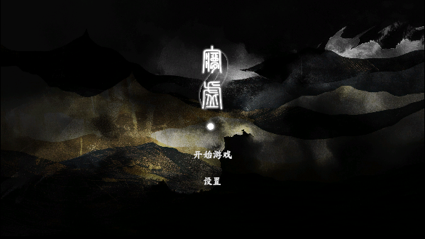
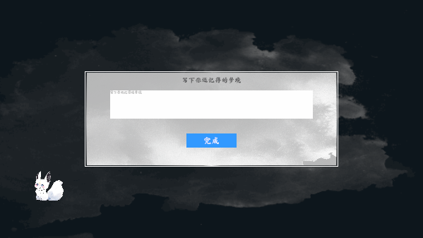
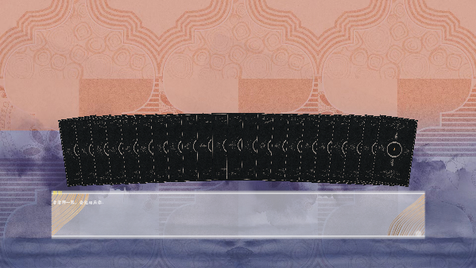
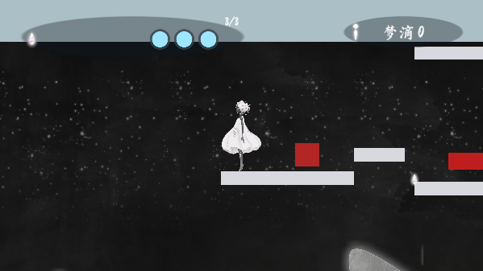
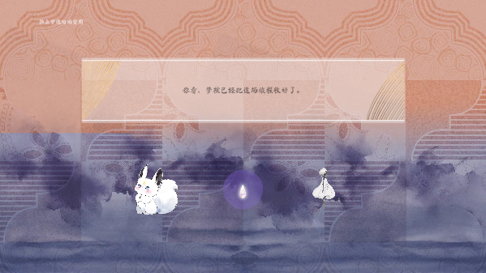

# 梦境拾荒者的旅程

腾讯 GameJam 2D 平台跳跃。从主菜单走进梦境引导，抽四张山海经塔罗，带着牌面效果跑完 A/B 关卡，最后进入回响空间。

Unity `6000.5.0f1` · URP · Input System · Cinemachine

## 画面

### 主菜单

### 梦境引导

### 塔罗抽牌

22 张牌背扇形摊开，点 4 张对应关卡节点 T1–T4，正逆位独立随机。

### 关卡

关卡在 Gameplay 场景里程序生成：区域 A → 传送门 → 区域 B → END。

### 回响空间

通关后淡入独立梦境回响，收束这一局旅程。

## 怎么玩

| 操作 | 键位 |
| --- | --- |
| 移动 | A / D 或 方向键 |
| 跳跃 | Space / W |
| 交互（塔罗节点、传送门等） | E / F |
| 攻击 | J / 鼠标左键 |
| 暂停 | Esc |

流程：开始游戏 → 引导写梦 → 抽 4 张塔罗 → 跑关（T1 T2 → 下一区域 → T3 T4 → END）→ 回响空间。

## 打开工程

1. 用 Unity Hub 打开本仓库，编辑器版本 **6000.5.0f1**
2. 配置梦笺用的 LLM Key（见下一节）
3. 从 `Boot` 场景进入 Play Mode（编辑器会自动先加载 Boot）
4. 主菜单点「开始游戏」

## 配置 LLM Key

通关后的梦笺会请求大模型。仓库里**没有** API Key，需要自己填一次。

1. 复制 `Assets/Game/Resources/DreamLetter/connection.json.example`  
   为同目录下的 `connection.json`（不要提交这个文件）
2. 把 `apiKey` 填成你的 **DeepSeek** Key  
   或在 Unity 菜单 `Tools → 梦墟 → 梦笺连接设置` 里填写并保存
3. 备用 `backup` 段可选；不填则只走 DeepSeek，失败时用本地兜底信

主模型是 DeepSeek `deepseek-flash`（`https://api.deepseek.com`）。Key 可在 [DeepSeek 开放平台](https://platform.deepseek.com) 申请。

没配 Key 时游戏仍能玩完，回响里会显示本地兜底梦笺，而不是联网生成。
